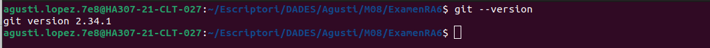
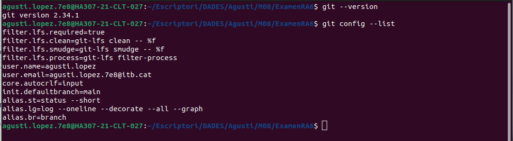
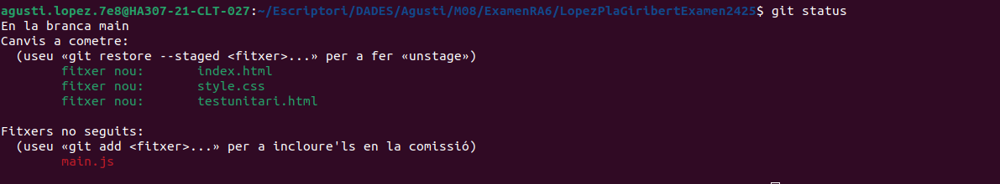
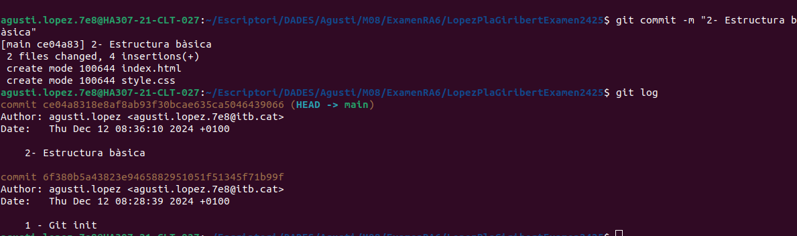
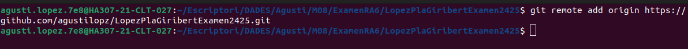
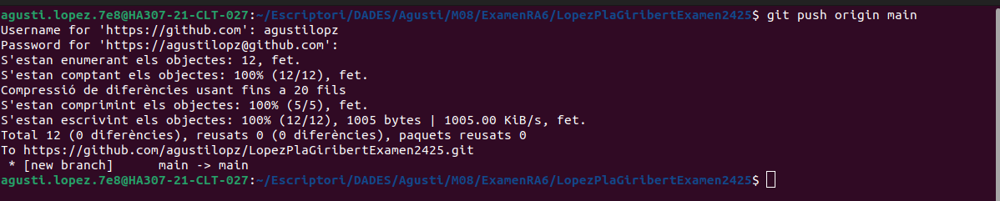

## Examen - RA6: Creació i Gestió d'un Projecte Web amb Git i Desplegament en Vercel | Agustí López Pla-Giribert

**1. Comprovar la versió instal·lada de Git.**

**2. Mostra la configuració actual per verificar-ho. Explica com veig que he configurat correctament el email i el nom.**

Per veure que he configurat correctament el nom i email, puc mirar als apartats "user.name" i "user.email" i si allà em surten el meu nom i email és que esta ben configurat. També podria accedir a `git config --global -e` i allà em sortira la mateixa informació a l'apartat `[user]`, i en cas de no haver-ho configurat sortiria buit.

**3. Utilitza un patró d'expressió regular per afegir tots els fitxers .html i .css.**

**4. Verifica l'estat del repositori.**

**5. Consulta l'historial de commits.**

**6. Configura un remot per al repositori que has de crear en GitHub, el nom del repositorio de GitHub ha de ser Cognom1Cognom2Examen2425.**

**7. Puja els canvis al remot desde terminal.**

**8. Publica el projecte a Vercel i indica l'enllaç en el document Markdown del examen.**

[Enllaç del projecte publicat a Vercel](https://lopez-pla-giribert-examen2425.vercel.app/)

*Aquest projecte forma part de l'examen de l'assignatura de Desplegament d'Aplicacions Web del CFGS DAWe*
