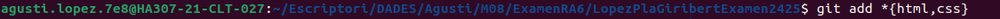

##Examen - RA6: Creació i Gestió d'un Projecte Web amb Git i Desplegament en Vercel
**1. Comprovar la versió instal·lada de Git**

**2. Mostra la configuració actual per verificar-ho. Explica com veig que he configurat correctament el email i el nom.**

**3. Utilitza un patró d'expressió regular per afegir tots els fitxers .html i .css.**

**4. Verifica l'estat del repositori**

**5. Consulta l'historial de commits**

**6. Configura un remot per al repositori que has de crear en GitHub, el nom del repositorio de GitHub ha de ser Cognom1Cognom2Examen2425.**

**7. Puja els canvis al remot desde terminal.**

Aquest projecte forma part de l'examen de M08
